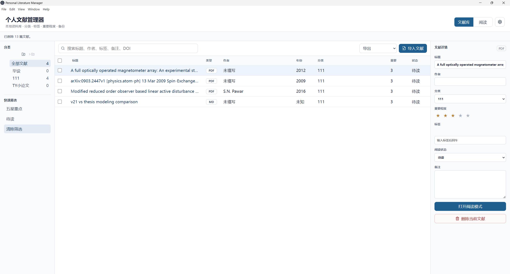
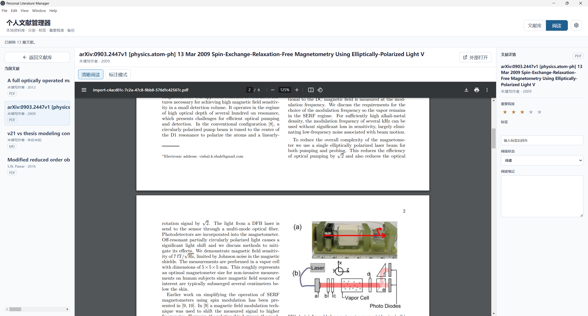
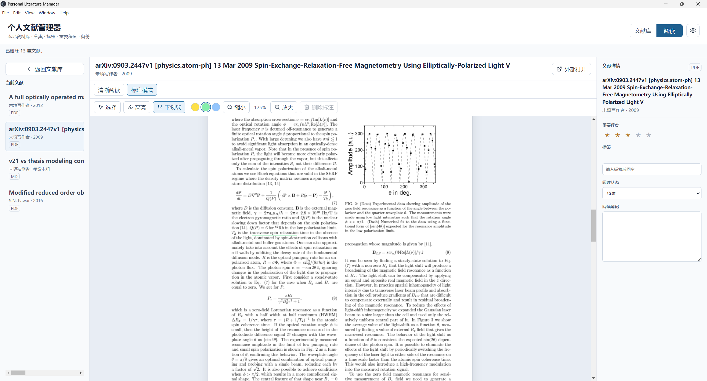

# Personal Literature Manager

个人文献管理小软件，不需要联网，不需要账号，只需要本地安装即可使用。

## 软件截图

### 主界面

### 阅读界面

## 下载

Windows 用户请前往 Releases 页面下载最新版 `.exe` 安装包：

https://github.com/hennrywang1225/Personal-Literature-Manager/releases

请下载 Assets 里的 `.exe` 文件，不要下载 Source code。

## 功能

- 本地文献管理
- 文献分类
- 阅读界面
- 不需要联网
- 不需要账号